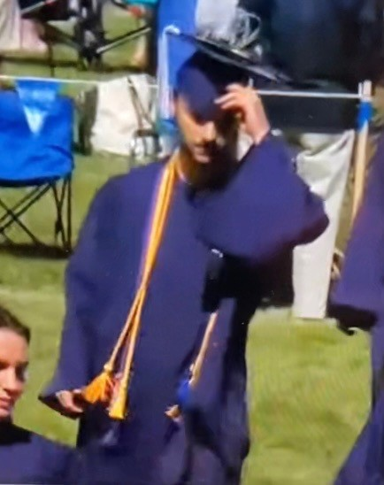

## Grad Cap
My high school graduation cap.

The cap included a blinking multicolor LED, a button to turn on and off the LED, a rotating servo, a potentiometer to control the LCD screen brightness, and an LCD screen.

The LCD screen had the stock price of SpaceX (albeit it is private—so not traded in realtime), the current uptime of the program (I think it reached over 10,000 seconds during my graduation, even though I unplugged and plugged it in again halfway through), and the current temperature from a voltage sensor (which wasn't following other formulas to convert to temperature, so I made a quick experimentally derived equation, which was also inaccurate).

I had a wire running down my back (for the power) the whole time.

Also, my grandma took these incredible shots of me with the cap:

    
    

